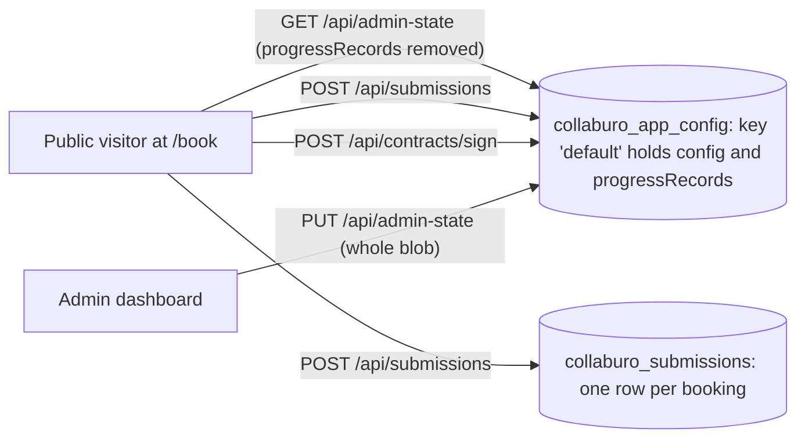

# Collaburo Database Guide: How Live Bookings Are Saved

A study guide to how the database looks once the booking form is public, how data is written, and what a developer needs to watch for.

---

## 1. The big picture

Everything lives in **two Postgres tables** (Neon). The most important thing to understand is that **each booking is stored in two places**, and that **some public API actions can change data without proper checks**.



---

## 2. The tables

Schema source: `db/schema.sql` (applied manually, no migration tool).

### Table 1: `collaburo_app_config`

A key/value table. Each row holds **one large JSON object** (a JSONB "blob").

| Column       | Type          | Meaning                              |
|--------------|---------------|--------------------------------------|
| `key`        | text (PK)     | Which blob this is                   |
| `payload`    | jsonb         | The entire JSON object               |
| `updated_at` | timestamptz   | Last write time (used for conflicts) |

It has two rows:

- **`key = 'default'`** holds the entire app state:
  - **Form setup:** steps, fields, rooms, rentals catalog, pricing, site/email settings.
  - **`progressRecords`:** an array of every booking, **capped at 500**. Each booking includes client details, answers, costs, progress status, contract signatures, signed contract HTML, an admin audit trail, and an activity log.
- **Admin accounts** are stored under a second key (`ACCOUNTS_KEY` in `lib/admin-accounts.js`).

Rough shape of the `default` payload:

```json
{
  "savedAt": "2026-09-27T15:00:00.000Z",
  "steps": [ ... ],
  "fields": [ ... ],
  "rentalsCatalog": [ ... ],
  "pricing": { ... },
  "siteSettings": { "emailSettings": { ... } },
  "progressRecords": [
    {
      "id": "…",
      "bookingCode": "B1A2B3",
      "submittedAt": "…",
      "client": { "name": "…", "email": "…" },
      "request": { "space": "…", "bookingDateTime": "…" },
      "answers": { ... },
      "costs": { "total": 0, "totalWithDeposit": 0 },
      "progress": {
        "status": "New inquiry",
        "contract": "Generated",
        "agreement": "Signed",
        "contractSignatures": { ... },
        "contractSignedHtml": "…",
        "lastActivityAt": "…"
      },
      "adminAudit": [ ... ],
      "log": [ ... ]
    }
  ]
}
```

### Table 2: `collaburo_submissions`

One row per booking. A few real columns for listing/filtering, plus a full copy of the booking in `payload`.

| Column         | Type          | Meaning                                         |
|----------------|---------------|-------------------------------------------------|
| `id`           | uuid (PK)     | Row id                                          |
| `client_name`  | text          | Copied from `payload.client.name`               |
| `client_email` | text          | Copied from `payload.client.email`              |
| `event_space`  | text          | Copied from `payload.request.space`             |
| `status`       | text          | Copied from `payload.progress.status`           |
| `total`        | numeric       | `costs.totalWithDeposit` or `costs.total`       |
| `payload`      | jsonb         | Full booking record (same shape as above)       |
| `fingerprint`  | text (unique) | SHA-256 of email + space + date + total (dedupe)|
| `created_at`   | timestamptz   | Insert time                                     |

---

## 3. How a public booking gets saved

1. **Loading the form.** The page calls `GET /api/admin-state`. The server strips `progressRecords` before responding, so visitors never see other clients' data.
2. **Submitting.** `POST /api/submissions` does two writes:
   - Inserts a row into `collaburo_submissions`, deduplicated by the fingerprint. A repeat submit returns `{ duplicate: true }`.
   - Reads the whole `default` blob, adds the booking to the front of `progressRecords`, and writes the whole blob back.
3. **Later actions** use the same `/api/submissions` route (via an `action` field) or `/api/contracts/sign`:
   - `touch-progress-record` – updates last-activity time
   - `get-progress-record` – fetch a booking by ID or booking code
   - `get-progress-record-by-email` – fetch by email (requires a verified email session)
   - `update-progress-record` – client edits a booking
   - `admin-update-booking` – admin edits a booking (admin-only)
   - `/api/contracts/sign` – client signs the contract
4. **Admin saves.** The dashboard sends the whole blob with `PUT /api/admin-state`, including `baseUpdatedAt`. If the database changed since the page loaded, the server returns **409 Conflict** instead of overwriting.

### Where each action writes

| Action                        | Writes blob (`progressRecords`) | Writes `collaburo_submissions` | Auth required        |
|-------------------------------|:-------------------------------:|:------------------------------:|----------------------|
| New submission                | yes                             | yes                            | none                 |
| `touch-progress-record`       | yes                             | yes (`lastActivityAt` only)    | none                 |
| `update-progress-record`      | yes                             | yes                            | **none**             |
| `admin-update-booking`        | yes                             | yes                            | admin                |
| `/api/contracts/sign`         | yes                             | **no**                         | none (rate-limited)  |
| `PUT /api/admin-state`        | yes (whole blob)                | **no**                         | admin                |

---

## 4. What needs attention (most urgent first)

### 4.1 Public requests can change any booking

In the public flow the client sends `action: "update-progress-record"` with a full record, and the server accepts it with no check:

```js
// app/api/submissions/route.js
if (body?.action === "update-progress-record") {
  const record = body.record;
  if (!record?.id) return /* 400 */;
  // ... no auth, no email-session check ...
  await replaceProgressRecordInAdminState(sql, record);
  await replaceSubmissionPayload(sql, record);
}
```

Anyone who knows or guesses a booking ID can replace that whole booking: `progress.status`, `costs`, `agreement: "Signed"`, and the audit log.

**Fix direction:** require the email-session token (like `get-progress-record-by-email` already does), only accept client-editable fields, and keep the server's existing values for status, costs, and contract fields.

### 4.2 Bookings can be read by guessing booking codes

`get-progress-record` returns the full booking, including personal details, to anyone who supplies an ID or booking code. Booking codes are `B` + 5 characters, and `/api/submissions` isn't in the middleware rate-limit list.

**Fix direction:** require email verification here too, or add a rate limit plus a Cloudflare WAF rule.

### 4.3 Bookings are stored twice and the copies drift apart

Each booking lives in `progressRecords` **and** in `collaburo_submissions`. Most paths update both, but not all:

- Contract signing only updates the blob, so the table still shows the booking as unsigned.
- Admin blob saves (`PUT /api/admin-state`) don't touch the table.
- Once `progressRecords` passes 500, the oldest bookings are silently dropped from the blob but remain in the table.

**Fix direction:** pick one source of truth. Recommended: `collaburo_submissions`, with `progressRecords` treated as a cache or removed.

### 4.4 Simultaneous writes can lose bookings

Every server-side blob write is *read the whole row → change it → write it back*, with no lock or version check (submit, touch, edit, contract sign). Two visitors submitting at the same moment can make one booking vanish from the blob. It survives in the table — another reason to make the table the source of truth. Only the admin `PUT` is protected by the 409 check.

### 4.5 The blob keeps growing

Every write resends everything: signatures, signed contract HTML, logs, audits, and up to 500 bookings. That gets slow, risks request-size limits on Workers and Neon, and increases the chance of conflicts from 4.4.

**Fix direction:** store images and signed documents in Cloudinary and keep only URLs in the database.

### 4.6 Legitimate bookings can be treated as duplicates

Two real bookings with the same email, space, date, and total are counted as one. The edit path also re-runs the fingerprint check when a row can't be found, which can overwrite an unrelated row.

### 4.7 Other things to watch

- **Missing `DATABASE_URL`:** routes silently fall back to in-memory storage, and every booking is lost when the worker restarts. Consider failing loudly in production.
- **Inconsistent default status:** new submissions start as `"New inquiry"`, updates default to `"In Discussion"`.
- **Open image uploads:** `/api/uploads/images` accepts uploads from anyone (120 per 5 minutes per worker instance), which could run up Cloudinary usage.
- **Backups and schema changes:** enable Neon point-in-time restore; keep `db/schema.sql` up to date since changes are applied by hand.
- **Outdated docs:** `AGENTS.md` says only two API routes are public. Now public: `admin-login`, `admin-logout`, `GET admin-state`, `POST submissions` (all actions), `contracts/sign`, `email-verification`, `uploads/images`.

---

## 5. Quick reference: files to read

| File                                   | What it does                                            |
|----------------------------------------|---------------------------------------------------------|
| `db/schema.sql`                        | Table definitions                                       |
| `app/api/admin-state/route.js`         | Load/save the whole blob; strips PII for public; 409s   |
| `app/api/submissions/route.js`         | New bookings + all the `action` variants                |
| `app/api/contracts/sign/route.js`      | Contract signing (blob only)                            |
| `lib/admin-accounts.js`                | Admin accounts stored under a separate config key       |
| `middleware.js`                        | Which API routes are public, admin auth, rate limits    |
